# Application Flow Diagrams - POS Jamur Cikuda Nusantara

## 1. Authentication Flow

### Role-based Access Control


### Authentication Sequence


---

## 2. POS Transaction Flow (Cashier)

### Complete Checkout Process


### Cart State Management


---

## 3. Owner Dashboard Details

### 3.1 Dashboard Overview


### 3.2 View Statistics Flow

````mermaid
sequenceDiagram
    participant O as Owner
### 5.2 Manage Categories Flow

```mermaid
sequenceDiagram
    participant O as Owner
    participant UI as Categories Page
    participant API as Laravel API
    participant DB as Database

    Note over O, UI: VIEW CATEGORIES
    O->>UI: Click "Categories" menu
    UI->>API: GET /api/categories
    API->>DB: SELECT * FROM categories
    DB-->>API: Categories list
    API-->>UI: JSON response
    UI-->>O: Display categories table

    Note over O, UI: ADD CATEGORY
    O->>UI: Click "Add Category"
    UI->>UI: Show form modal
    O->>UI: Enter category name
    O->>UI: Click "Save"
    UI->>API: POST /api/categories<br/>{name, is_active: true}
    activate API
    API->>DB: INSERT INTO categories
    DB-->>API: New category ID
    API-->>UI: {success: true, category}
    deactivate API
    UI->>UI: Refresh list
    UI-->>O: Show success toast

    Note over O, UI: EDIT CATEGORY
    O->>UI: Click "Edit" on category
    UI->>UI: Show form modal with data
    O->>UI: Modify name
    O->>UI: Click "Update"
    UI->>API: PUT /api/categories/{id}<br/>{name}
    API->>DB: UPDATE categories
    API-->>UI: {success: true}
    UI->>UI: Refresh list
    UI-->>O: Show success toast

    Note over O, UI: TOGGLE ACTIVE STATUS
    O->>UI: Click toggle switch
    UI->>API: PATCH /api/categories/{id}/toggle
    API->>DB: UPDATE categories<br/>SET is_active = !is_active
    API-->>UI: {success: true}
    UI->>UI: Update UI
    UI-->>O: Category updated
````

---

## 6participant DB as Database

    Note over O, UI: PAGE LOAD
    O->>UI: Access /dashboard/owner
    UI->>API: GET /api/dashboard/statistics
    activate API

    Note over API, DB: FETCH TODAY'S DATA
    API->>DB: SELECT SUM(grand_total)<br/>FROM orders WHERE DATE(created_at) = TODAY
    DB-->>API: Total Sales Today

    API->>DB: SELECT COUNT(*) FROM orders<br/>WHERE DATE(created_at) = TODAY
    DB-->>API: Total Orders Today

    API->>DB: SELECT COUNT(*) FROM orders<br/>WHERE payment_status = 'UNPAID'
    DB-->>API: Pending Payments Count

    API->>DB: SELECT DATE(created_at), SUM(grand_total)<br/>FROM orders WHERE created_at >= LAST_7_DAYS<br/>GROUP BY DATE(created_at)
    DB-->>API: Weekly Revenue Data

    API-->>UI: {<br/>totalSalesToday,<br/>totalOrders,<br/>pendingPayments,<br/>weeklyChart<br/>}
    deactivate API

    UI->>UI: Render Statistics Cards
    UI->>UI: Render Revenue Chart
    UI-->>O: Display Dashboard

````

### 3.3 Statistics Card Details

**Cards to Display:**

1. **Total Penjualan Hari Ini**
   - Value: Rp XXX.XXX
   - Icon: 💰
   - Color: Green
   - Query: `SUM(grand_total) WHERE DATE(created_at) = TODAY`

2. **Total Order Hari Ini**
   - Value: XX pesanan
   - Icon: 📦
   - Color: Blue
   - Query: `COUNT(*) FROM orders WHERE DATE(created_at) = TODAY`

3. **Pembayaran Pending**
   - Value: XX order
   - Icon: ⏳
   - Color: Orange
   - Query: `COUNT(*) WHERE payment_status = 'UNPAID'`

4. **WhatsApp Gagal Terkirim**
   - Value: XX order
   - Icon: ❌
   - Color: Red
   - Query: `COUNT(*) WHERE wa_sent_status = 'FAILED'`

5. **Revenue Chart (7 Hari Terakhir)**
   - Type: Line/Bar Chart
   - X-axis: Tanggal
   - Y-axis: Total Penjualan
   - Library: Chart.js / Recharts

---

## 4. POS Dashboard Details (Cashier)

### 4.1 Dashboard Overview

```mermaid
graph TB
    A[POS Dashboard] --> B[Product Grid]
    A --> C[Shopping Cart Sidebar]
    A --> D[Checkout Modal]

    B --> B1[Product Cards]
    B --> B2[Search Products]
    B --> B3[Filter by Category]
    B --> B4[Show Active Only]

    B1 --> B1A[Product Image]
    B1 --> B1B[Product Name]
    B1 --> B1C[Price]
    B1 --> B1D[Add to Cart Button]

    C --> C1[Cart Items List]
    C --> C2[Quantity Controls +/-]
    C --> C3[Remove Item Button]
    C --> C4[Subtotal Display]
    C --> C5[Shipping Cost Input]
    C --> C6[Grand Total]
    C --> C7[Checkout Button]

    D --> D1[Customer Form]
    D --> D2[Order Summary]
    D --> D3[Submit Order]

    D1 --> D1A[Customer Name]
    D1 --> D1B[Phone Number]
    D1 --> D1C[Address]
    D1 --> D1D[Notes Optional]
````

### 4.2 Browse Products & Add to Cart Flow

```mermaid
sequenceDiagram
    participant C as Cashier
    participant UI as POS UI
    participant LS as LocalStorage
    participant API as Laravel API
    participant DB as Database

    Note over C, UI: INITIAL LOAD
    C->>UI: Open /dashboard/pos
    UI->>API: GET /api/products?is_active=1
    activate API
    API->>DB: SELECT * FROM products<br/>WHERE is_active = true<br/>JOIN categories
    DB-->>API: Active products list
    API-->>UI: [{id, name, price, image_url}]
    deactivate API

    UI->>LS: Load cart from 'pos_cart'
    LS-->>UI: Cart data or []
    UI->>UI: Render product grid
    UI->>UI: Render cart sidebar
    UI-->>C: Display dashboard

    Note over C, UI: SEARCH/FILTER
    C->>UI: Type in search box
    UI->>UI: Filter products by name
    UI-->>C: Update product grid

    C->>UI: Select category filter
    UI->>UI: Filter products by category
    UI-->>C: Update product grid

    Note over C, LS: ADD TO CART
    C->>UI: Click "Add to Cart" on Product
    UI->>UI: Check if product in cart
    alt Product already in cart
        UI->>LS: Increment quantity
    else New product
        UI->>LS: Push {id, name, price, qty: 1}
    end
    LS-->>UI: Updated cart
    UI->>UI: Update cart sidebar
    UI->>UI: Show toast: "Produk ditambahkan"
    UI-->>C: Cart updated

    Note over C, UI: ADJUST QUANTITY
    C->>UI: Click + or - on cart item
    UI->>LS: Update quantity
    LS-->>UI: Updated cart
    UI->>UI: Recalculate totals
    UI-->>C: Display new total

    Note over C, UI: REMOVE ITEM
    C->>UI: Click remove icon
    UI->>LS: Remove item from array
    LS-->>UI: Updated cart
    UI->>UI: Update cart sidebar
    UI-->>C: Item removed
```

### 4.3 Checkout Process Detail


### 4.4 POS UI Components Breakdown

#### Product Card Component

```javascript
{
  id: "uuid",
  name: "Jamur Crispy Original",
  description: "Jamur crispy dengan bumbu original",
  price: 25000,
  image_url: "/storage/products/jamur-original.jpg",
  category: {
    id: 1,
    name: "Crispy"
  },
  is_active: true
}
```

#### Cart Item Structure (LocalStorage)

```javascript
{
    pos_cart: [
        {
            id: 'product-uuid-1',
            name: 'Jamur Crispy Original',
            price: 25000,
            quantity: 2,
            subtotal: 50000,
        },
        {
            id: 'product-uuid-2',
            name: 'Jamur Crispy Pedas',
            price: 27000,
            quantity: 1,
            subtotal: 27000,
        },
    ];
}
```

#### Cart Summary Display

```
Subtotal:        Rp  77.000
Ongkir:          Rp  10.000
─────────────────────────────
TOTAL:           Rp  87.000
```

---

## 5. Product Management Flow (Owner)

### CRUD Operations

````mermaid
graph TD
    A[Owner Dashboard] --> B[Products Menu]
    B --> C{Select Action}

    C -->|Create| D[Create Product Form]
    D --> E[Select Category]
    D --> F[Upload Image]
    D --> G[Set Price & Description]
    G --> H[Submit]
    H --> I{Validation}
    I -->|Pass| J[Save to DB]
    I -->|Fail| D
    J --> K[Show Success]

    C -->|Update| L[Select Product]
    L --> M[Edit Form]
    M --> N[Modify Fields]
    N --> O[Submit]
    O --> P{Validation}
    P -->|Pass| Q[Update DB]
    P -->|Fail| M
    Q --> K

    C -->|Deactivate| R[Toggle is_active]
    R --> S[Update DB]
    S --> K

    C -->|Delete| T{Has Orders?}
### 6.2 View Order Detail

```mermaid
sequenceDiagram
    participant O as Owner
    participant UI as Order Detail Modal
    participant API as Laravel API
    participant DB as Database

    O->>UI: Click "View Detail" on order
    UI->>API: GET /api/orders/{id}
    activate API
    API->>DB: SELECT orders<br/>JOIN customers, users<br/>WHERE id = ?
    DB-->>API: Order header data
    API->>DB: SELECT order_items<br/>JOIN products<br/>WHERE orders_id = ?
    DB-->>API: Order items
    API-->>UI: {order, customer, user, items}
    deactivate API

    UI->>UI: Render order info
    UI-->>O: Display modal with:<br/>- Customer info<br/>- Items list<br/>- Payment status<br/>- WA status<br/>- Total amount

    Note over O, UI: ACTIONS AVAILABLE
    O->>UI: Click "Update Payment Status"
    UI->>API: PATCH /api/orders/{id}/status
    API->>DB: UPDATE payment_status
    API-->>UI: Success
    UI-->>O: Status updated

    O->>UI: Click "Resend WhatsApp"
    UI->>API: POST /api/orders/{id}/resend-wa
    API->>API: Call FonnteService
    API-->>UI: {wa_status}
    UI-->>O: Show result message
````

### 6.3 Filter & Search Orders

```mermaid
graph TB
    A[Orders Page] --> B[Filter Panel]
    B --> C[By Payment Status]
    B --> D[By WA Status]
    B --> E[By Date Range]
    B --> F[By Customer Name]

    C --> C1[All]
    C --> C2[UNPAID]
    C --> C3[PAID]
    C --> C4[CANCELLED]

    D --> D1[All]
    D --> D2[PENDING]
    D --> D3[SENT]
    D --> D4[FAILED]

    E --> E1[Today]
    E --> E2[Last 7 Days]
    E --> E3[Last 30 Days]
    E --> E4[Custom Range]

    F --> F1[Search Input]
    F1 --> F2[Real-time Filter]
```

---

## 7V --> W[DELETE FROM products]

    W --> K

````

---

## 4. Order Management Flow (Owner)

### View & Update Orders

```mermaid
sequenceDiagram
    participant O as Owner
    participant UI as Dashboard UI
    participant API as Laravel API
    participant DB as Database
### 7.2 Resend Failed WhatsApp Messages

```mermaid
sequenceDiagram
    participant O as Owner
    participant UI as Dashboard UI
    participant API as Laravel API
    participant Fonnte as Fonnte API
    participant DB as Database

    Note over O, UI: VIEW FAILED MESSAGES
    O->>UI: Navigate to "Failed WA" section
    UI->>API: GET /api/orders?wa_sent_status=FAILED
    API->>DB: SELECT orders WHERE wa_sent_status = 'FAILED'
    DB-->>API: List of failed orders
    API-->>UI: Failed orders list
    UI-->>O: Display table with retry options

    Note over O, UI: RETRY SINGLE MESSAGE
    O->>UI: Click "Retry" on order
    UI->>API: POST /api/orders/{id}/resend-wa
    activate API

    API->>DB: SELECT order with relations
    DB-->>API: Order data
    API->>API: Build message via FonnteService
    API->>Fonnte: POST /send
    activate Fonnte
    Fonnte-->>API: {status, message_id}
    deactivate Fonnte

    alt Success
        API->>DB: UPDATE wa_sent_status = 'SENT'
### 8.2 Specific Error Scenarios

#### Checkout Errors

```mermaid
graph TD
    A[Submit Checkout] --> B{Validation}
    B -->|Empty Cart| C[Error: Keranjang kosong]
    B -->|No Customer Name| D[Error: Nama wajib diisi]
    B -->|Invalid Phone| E[Error: No. HP tidak valid]
    B -->|Pass| F[Process Order]

    F --> G{Database Transaction}
    G -->|Success| H{WhatsApp Send}
    G -->|Fail| I[Error: Gagal menyimpan order]

    H -->|Success| J[Complete Success]
    H -->|Fail| K[Order saved, WA failed]

    C --> L[Stay on page]
    D --> L
    E --> L
    I --> L
    K --> M[Show partial success]
    J --> N[Clear cart, show success]
````

#### Product Management Errors

```mermaid
graph TD
    A[Delete Product Request] --> B{Check Usage}
    B -->|Used in Orders| C[Error: Cannot delete]
    B -->|Not Used| D{Confirm Delete}

    D -->|Cancel| E[Keep Product]
    D -->|Confirm| F[Delete from DB]

    C --> G[Suggest: Deactivate instead]
    G --> H[Toggle is_active = false]
```

---

## 9else Failed

        API->>DB: UPDATE wa_sent_status = 'FAILED'
        API-->>UI: {success: false, error}
        UI-->>O: Show: "Masih gagal ❌"
    end
    deactivate API

    Note over O, UI: BULK RETRY
    O->>UI: Select multiple orders
    O->>UI: Click "Retry Selected"
    loop For each selected order
        UI->>API: POST /api/orders/{id}/resend-wa
        API->>Fonnte: Send message
        API->>DB: Update status
    end
    UI-->>O: Show summary:<br/>"5 berhasil, 2 gagal"

```

---

## 8O->>UI: Open "Orders" page
    UI->>API: GET /orders?page=1
    activate API
    API->>DB: SELECT orders<br/>JOIN users, customers<br/>ORDER BY created_at DESC
    DB-->>API: Order list with relations
    API-->>UI: JSON response
    deactivate API
    UI-->>O: Display orders table

    Note over O, UI: FILTER ORDERS
    O->>UI: Filter by status/date
    UI->>API: GET /orders?status=PAID
    API->>DB: SELECT with WHERE clause
    DB-->>API: Filtered results
    API-->>UI: Updated list

    Note over O, UI: UPDATE STATUS
    O->>UI: Click "Mark as Paid"
    UI->>UI: Show confirmation
    O->>UI: Confirm
    UI->>API: PATCH /orders/{id}/status<br/>{payment_status: 'PAID'}
    activate API
    API->>DB: UPDATE orders SET payment_status = 'PAID'
    DB-->>API: Success
    API->>API: Log activity
    API-->>UI: {success: true}
    deactivate API
    UI-->>O: Show success notification
    UI->>UI: Refresh order list
```

---

## 5. WhatsApp Integration Flow (Fonnte Gateway)

### Automatic Message Sending via API

```mermaid
graph TD
    A[Order Created Successfully] --> B[Get Order Data]
    B --> C[Get Customer Phone]
    B --> D[Get Order Items]
    B --> E[Get Total Amount]

    C --> F[Format Phone Number]
    F --> G{Valid Format?}
    G -->|No| H[Remove leading 0<br/>Add +62]
    G -->|Yes| I[Proceed]
    H --> I

    D --> J[Build Items List]
    E --> K[Format Currency IDR]

    I --> L[Compose Message Template]
    J --> L
    K --> L

    L --> M[Call FonnteService]
    M --> N[HTTP POST to Fonnte API]
    N --> O{API Response}

    O -->|200 Success| P[Parse message_id]
    O -->|4xx/5xx Error| Q[Log error details]

    P --> R[Update wa_sent_status = 'SENT']
    Q --> S[Update wa_sent_status = 'FAILED']

    R --> T[Save to database]
    S --> T

    T --> U[Return to frontend]
    U --> V{Status?}
    V -->|SENT| W[Show: Pesan terkirim ✓]
    V -->|FAILED| X[Show: Gagal kirim, coba lagi]

    W --> Y[End]
    X --> Y
```



### WhatsApp Message Template (Fonnte Format)

```php
// Format message untuk Fonnte API
$message = "Halo *{$customer->name}*! 👋\n\n";
$message .= "Terima kasih sudah order di *Jamur Cikuda Nusantara*\n\n";
$message .= "📋 *Detail Pesanan*\n";
$message .= "Order ID: {$order->id}\n";
$message .= "Tanggal: {$order->created_at->format('d M Y H:i')}\n\n";
$message .= "🛒 *Produk yang dipesan:*\n";

foreach ($order->items as $item) {
    $message .= "- {$item->product->name} x{$item->quantity} = Rp " . number_format($item->subtotal, 0, ',', '.') . "\n";
}

$message .= "\n💰 *Total Pembayaran*\n";
$message .= "Subtotal: Rp " . number_format($order->total_amount, 0, ',', '.') . "\n";
$message .= "Ongkir: Rp " . number_format($order->shiping_cost, 0, ',', '.') . "\n";
$message .= "*TOTAL: Rp " . number_format($order->grand_total, 0, ',', '.') . "*\n\n";
$message .= "📍 Alamat Pengiriman:\n{$customer->address}\n\n";
$message .= "Mohon segera lakukan pembayaran ya! 🙏";

return $message;
```

**Fonnte API Request Example:**

```json
{
    "target": "628123456789",
    "message": "Halo *John Doe*! 👋\n\nTerima kasih sudah order...",
    "countryCode": "62"
}
```

---

## 6. Error Handling Flow

### General Error Handling


---

## 7. Data Synchronization Flow

### LocalStorage ↔ Backend Sync


---

**Version:** 1.0  
**Last Updated:** January 23, 2026
