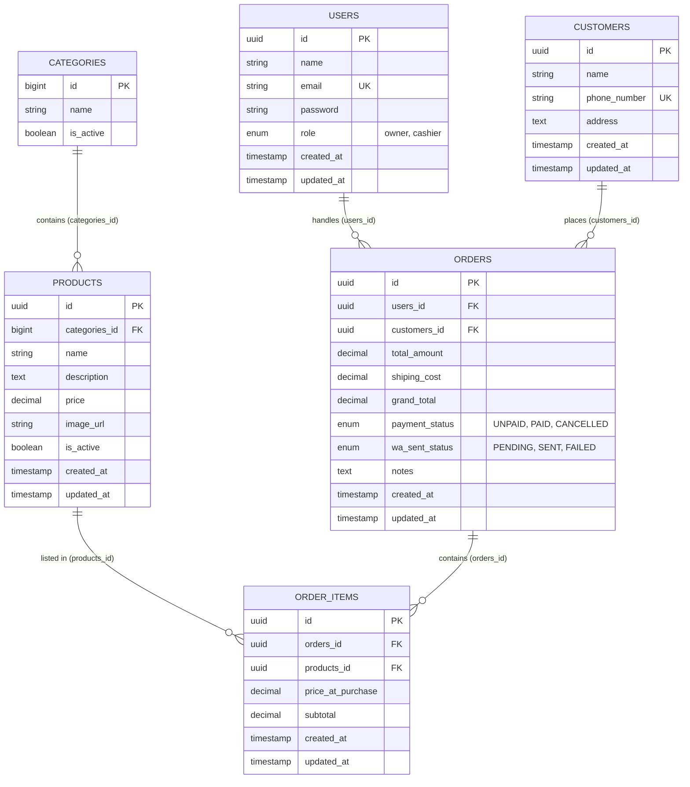

# Database Diagram - POS Jamur Cikuda Nusantara

## Entity Relationship Diagram



## Table Details

### 1. USERS

**Purpose:** Store user accounts for Owner and Cashier

| Column     | Type      | Constraints      | Description          |
| ---------- | --------- | ---------------- | -------------------- |
| id         | UUID      | PRIMARY KEY      | Unique identifier    |
| name       | VARCHAR   | NOT NULL         | User's full name     |
| email      | VARCHAR   | UNIQUE, NOT NULL | Login email          |
| password   | VARCHAR   | NOT NULL         | Hashed password      |
| role       | ENUM      | NOT NULL         | 'owner' or 'cashier' |
| created_at | TIMESTAMP |                  | Record creation time |
| updated_at | TIMESTAMP |                  | Last update time     |

**Relationships:**

- One user can handle many orders (1:N)

---

### 2. CUSTOMERS

**Purpose:** Store customer information for order tracking

| Column       | Type         | Constraints      | Description          |
| ------------ | ------------ | ---------------- | -------------------- |
| id           | UUID         | PRIMARY KEY      | Unique identifier    |
| name         | VARCHAR      | NOT NULL         | Customer name        |
| phone_number | VARCHAR(255) | UNIQUE, NOT NULL | WhatsApp number      |
| address      | TEXT         | NULLABLE         | Delivery address     |
| created_at   | TIMESTAMP    |                  | Record creation time |
| updated_at   | TIMESTAMP    |                  | Last update time     |

**Relationships:**

- One customer can place many orders (1:N)

**Business Rules:**

- Phone number must be unique (used for WhatsApp)
- Auto-created if not exists during checkout

---

### 3. CATEGORIES

**Purpose:** Product categorization

| Column    | Type         | Constraints                 | Description       |
| --------- | ------------ | --------------------------- | ----------------- |
| id        | BIGINT       | PRIMARY KEY, AUTO_INCREMENT | Unique identifier |
| name      | VARCHAR(100) | NOT NULL                    | Category name     |
| is_active | BOOLEAN      | DEFAULT TRUE                | Active status     |

**Relationships:**

- One category contains many products (1:N)

**Business Rules:**

- Cannot be deleted if products exist
- Can be deactivated to hide from selection

---

### 4. PRODUCTS

**Purpose:** Store product catalog

| Column        | Type          | Constraints                 | Description           |
| ------------- | ------------- | --------------------------- | --------------------- |
| id            | UUID          | PRIMARY KEY                 | Unique identifier     |
| categories_id | BIGINT        | FOREIGN KEY (categories.id) | Category reference    |
| name          | VARCHAR       | NOT NULL                    | Product name          |
| description   | TEXT          |                             | Product description   |
| price         | DECIMAL(10,2) | NOT NULL                    | Current selling price |
| image_url     | VARCHAR       |                             | Product image path    |
| is_active     | BOOLEAN       | DEFAULT TRUE                | Available for sale    |
| created_at    | TIMESTAMP     |                             | Record creation time  |
| updated_at    | TIMESTAMP     |                             | Last update time      |

**Relationships:**

- Belongs to one category (N:1)
- Listed in many order items (1:N)

**Business Rules:**

- Only active products shown in POS
- Cannot be deleted if used in orders
- Price changes don't affect past orders

---

### 5. ORDERS

**Purpose:** Store order header information

| Column         | Type          | Constraints                | Description                   |
| -------------- | ------------- | -------------------------- | ----------------------------- |
| id             | UUID          | PRIMARY KEY                | Unique identifier             |
| users_id       | UUID          | FOREIGN KEY (users.id)     | Cashier who created order     |
| customers_id   | UUID          | FOREIGN KEY (customers.id) | Customer who placed order     |
| total_amount   | DECIMAL(12,2) | NOT NULL                   | Sum of order items            |
| shiping_cost   | DECIMAL(10,2) | DEFAULT 0                  | Delivery fee                  |
| grand_total    | DECIMAL(12,2) | NOT NULL                   | total + shipping              |
| payment_status | ENUM          | DEFAULT 'UNPAID'           | 'UNPAID', 'PAID', 'CANCELLED' |
| wa_sent_status | ENUM          | DEFAULT 'PENDING'          | 'PENDING', 'SENT', 'FAILED'   |
| notes          | TEXT          | NULLABLE                   | Order notes                   |
| created_at     | TIMESTAMP     |                            | Order creation time           |
| updated_at     | TIMESTAMP     |                            | Last update time              |

**Relationships:**

- Handled by one user (N:1)
- Placed by one customer (N:1)
- Contains many order items (1:N)

**Business Rules:**

- grand_total = total_amount + shiping_cost
- Cannot be deleted, only cancelled
- WhatsApp message sent automatically via Fonnte API after creation
- `wa_sent_status` updated based on API response:
    - `PENDING` = Not yet sent or queued
    - `SENT` = Successfully delivered to Fonnte
    - `FAILED` = API error or invalid phone number

---

### 6. ORDER_ITEMS

**Purpose:** Store individual products in each order

| Column            | Type          | Constraints               | Description                        |
| ----------------- | ------------- | ------------------------- | ---------------------------------- |
| id                | UUID          | PRIMARY KEY               | Unique identifier                  |
| orders_id         | UUID          | FOREIGN KEY (orders.id)   | Parent order                       |
| products_id       | UUID          | FOREIGN KEY (products.id) | Product reference                  |
| price_at_purchase | DECIMAL(10,2) | NOT NULL                  | Price when ordered                 |
| subtotal          | DECIMAL(12,2) | NOT NULL                  | Total (qty stored in cart, not DB) |
| created_at        | TIMESTAMP     |                           | Record creation time               |
| updated_at        | TIMESTAMP     |                           | Last update time                   |

**Relationships:**

- Belongs to one order (N:1)
- References one product (N:1)

**Business Rules:**

- price_at_purchase locks the price at order time
- subtotal = total price for this item (quantity implicit: subtotal / price_at_purchase)
- Quantity tracked in frontend cart only, not stored in database
- Cannot be modified after order creation
- To get quantity: `quantity = subtotal / price_at_purchase`

---

## Foreign Key Naming Convention

⚠️ **CRITICAL**: This project uses **PLURAL** foreign key naming:

| Standard Laravel | This Project    | Table Reference |
| ---------------- | --------------- | --------------- |
| `user_id`        | `users_id`      | users           |
| `customer_id`    | `customers_id`  | customers       |
| `category_id`    | `categories_id` | categories      |
| `product_id`     | `products_id`   | products        |
| `order_id`       | `orders_id`     | orders          |

**Eloquent Relationships Must Specify:**

```php
// ❌ Wrong (will fail)
public function category() {
    return $this->belongsTo(Category::class);
}

// ✅ Correct
public function category() {
    return $this->belongsTo(Category::class, 'categories_id');
}
```

---

## Data Flow Diagram

```mermaid
graph LR
    A[Cashier] -->|Select Products| B[Shopping Cart]
    B -->|Checkout| C[Create Customer]
    C -->|Create| D[Order Header]
    D -->|Create| E[Order Items]
    E -->|Calculate| F[Total Amount]
    F -->|Add Shipping| G[Grand Total]
    G -->|Generate| H[WhatsApp Message]
    H -->|Send| I[Customer]
```



---

## Indexes & Performance

### Recommended Indexes

```sql
-- Users
CREATE INDEX idx_users_email ON users(email);
CREATE INDEX idx_users_role ON users(role);

-- Customers
CREATE INDEX idx_customers_phone ON customers(phone_number);

-- Products
CREATE INDEX idx_products_category ON products(categories_id);
CREATE INDEX idx_products_active ON products(is_active);

-- Orders
CREATE INDEX idx_orders_user ON orders(users_id);
CREATE INDEX idx_orders_customer ON orders(customers_id);
CREATE INDEX idx_orders_status ON orders(payment_status);
CREATE INDEX idx_orders_date ON orders(created_at);

-- Order Items
CREATE INDEX idx_order_items_order ON order_items(orders_id);
CREATE INDEX idx_order_items_product ON order_items(products_id);
```

---

**Version:** 1.0  
**Last Updated:** January 23, 2026
