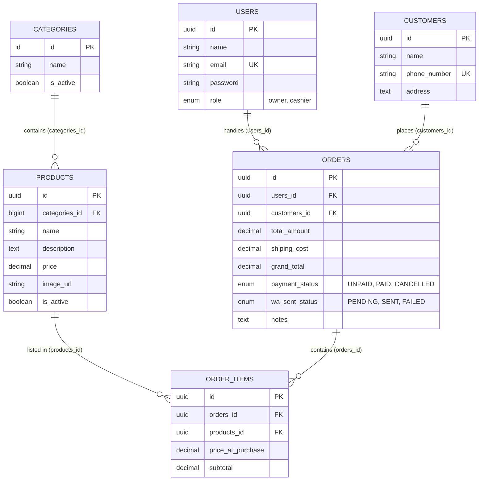
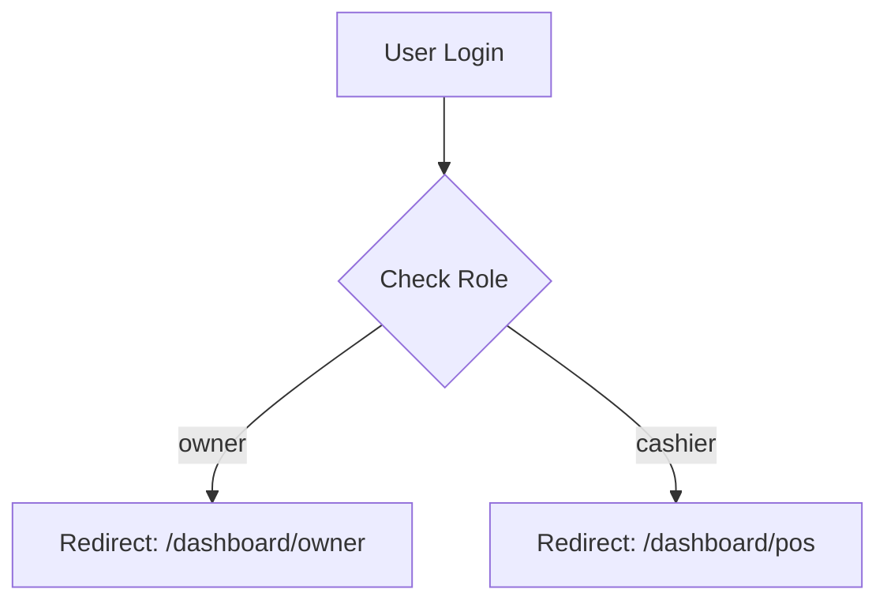
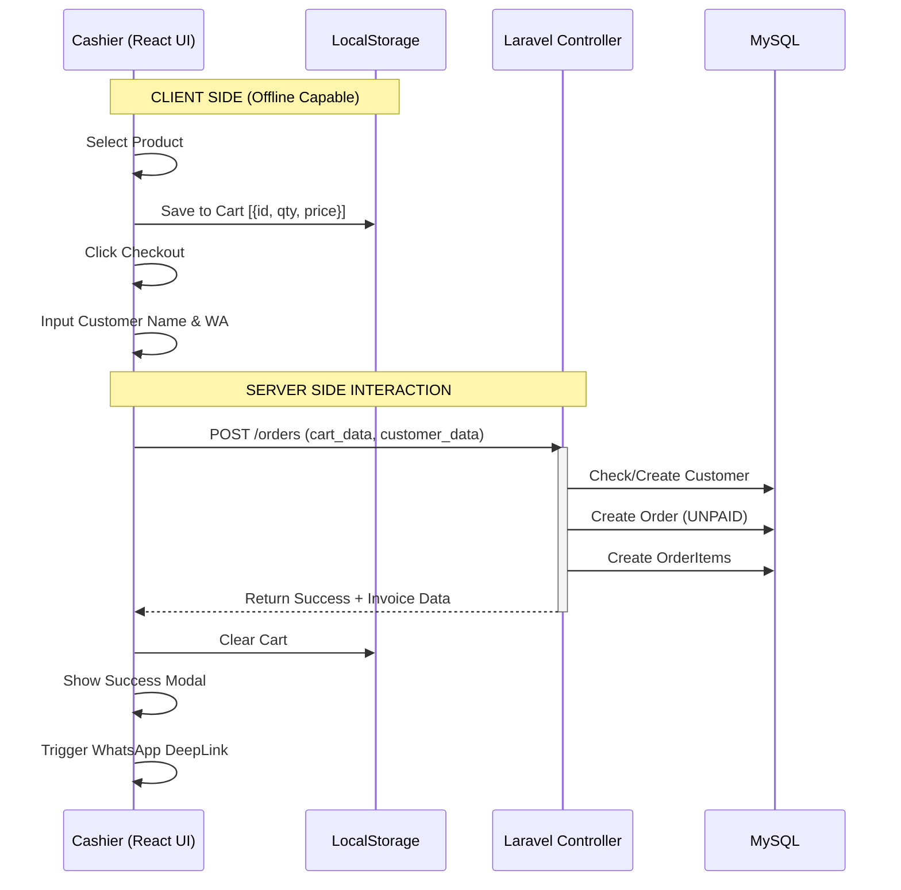

# PROJECT BLUEPRINT: POS Jamur Cikuda Nusantara

**Version:** 1.0  
**Context:** Point of Sales (POS) System for a Mushroom Snack Business  
**Target Users:** Cashiers (Pegawai) & Owner

---

## 1. Technology Stack

- **Backend:** Laravel 12 + PHP 8.2+
- **Frontend:** Inertia.js 2.0 + React 19 (Functional Components) + TypeScript 5.7
- **Styling:** Tailwind CSS 4.0
- **Build Tool:** Vite 7.0

* **Database:** MySQL
* **WhatsApp Gateway:** Fonnte API (https://fonnte.com)
* **State Management:** React Context + `localStorage` (for Shopping Cart)
* **Design System:** Mobile-First, Primary Color: `#20477c`

---

## 2. Database Schema (Single Source of Truth)

**CRITICAL NOTE FOR AI:** The database uses custom foreign key naming conventions (plural `_id`, e.g., `categories_id`, `users_id`). You **MUST** manually specify these keys in Eloquent relationships.

### ER Diagram (Mermaid)



### Raw Schema Reference (Laravel Migration)

Use this exact structure. **Do not change column names.**

#### Users Table

```php
Schema::create('users', function (Blueprint $table) {
    $table->uuid('id')->primary();
    $table->string('name');
    $table->string('email')->unique();
    $table->string('password');
    $table->enum('role', ['owner', 'cashier']);
    $table->timestamps();
});
```

#### Customers Table

```php
Schema::create('customers', function (Blueprint $table) {
    $table->uuid('id')->primary();
    $table->string('name');
    $table->string('phone_number', 255)->unique();
    $table->text('address')->nullable();
    $table->timestamps();
});
```

#### Categories Table

```php
Schema::create('categories', function (Blueprint $table) {
    $table->id();
    $table->string('name', 100);
    $table->boolean('is_active')->default(true);
    // Note: No timestamps in this table
});
```

#### Products Table

```php
Schema::create('products', function (Blueprint $table) {
    $table->uuid('id')->primary();
    $table->foreignId('categories_id')->constrained('categories')->onDelete('cascade');
    $table->string('name');
    $table->text('description');
    $table->decimal('price', 10, 2);
    $table->string('image_url');
    $table->boolean('is_active')->default(true);
    $table->timestamps();
});
```

#### Orders Table

```php
Schema::create('orders', function (Blueprint $table) {
    $table->uuid('id')->primary();
    $table->uuid('users_id');
    $table->foreign('users_id')->references('id')->on('users')->onDelete('cascade');
    $table->uuid('customers_id');
    $table->foreign('customers_id')->references('id')->on('customers')->onDelete('cascade');
    $table->decimal('total_amount', 12, 2);
    $table->decimal('shiping_cost', 10, 2)->default(0);
    $table->decimal('grand_total', 12, 2);
    $table->enum('payment_status', ['UNPAID', 'PAID', 'CANCELLED'])->default('UNPAID');
    $table->enum('wa_sent_status', ['PENDING', 'SENT', 'FAILED'])->default('PENDING');
    $table->text('notes')->nullable();
    $table->timestamps();
});
```

#### Order Items Table

```php
Schema::create('order_items', function (Blueprint $table) {
    $table->uuid('id')->primary();
    $table->uuid('orders_id');
    $table->foreign('orders_id')->references('id')->on('orders')->onDelete('cascade');
    $table->uuid('products_id');
    $table->foreign('products_id')->references('id')->on('products')->onDelete('cascade');
    $table->decimal('price_at_purchase', 10, 2);
    $table->decimal('subtotal', 12, 2);
    $table->timestamps();
});

// IMPORTANT: Quantity is calculated from subtotal / price_at_purchase
// Or stored in cart frontend only, not in database
```

---

## 3. Application Flow & Logic

### A. Authentication Flow

Logic to separate Owner and Cashier views.



### B. POS Transaction Flow (Cashier)

This flow explains how the localStorage cart interacts with the Backend.



---

## 4. Implementation Details (Backend)

### Eloquent Models Requirement

Because of the custom column names, Models must be defined strictly as follows:

#### User Model

```php
public function orders() {
    return $this->hasMany(Order::class, 'users_id');
}
```

#### Product Model

```php
public function category() {
    return $this->belongsTo(Category::class, 'categories_id');
}
```

#### Order Model

```php
public function user() {
    return $this->belongsTo(User::class, 'users_id');
}

public function customer() {
    return $this->belongsTo(Customer::class, 'customers_id');
}

public function items() {
    return $this->hasMany(OrderItem::class, 'orders_id');
}
```

#### OrderItem Model

```php
public function order() {
    return $this->belongsTo(Order::class, 'orders_id');
}

public function product() {
    return $this->belongsTo(Product::class, 'products_id');
}
```

---

## 5. Implementation Details (Frontend)

### Theme Configuration

**Primary Color:** `#20477c`

Extend Tailwind config:

```javascript
theme: {
  extend: {
    colors: {
      primary: '#20477c',
      secondary: '#...', // derived lighter shade
    }
  }
}
```

### Cart Logic (React Hook)

Create a hook `useCart` that handles:

- **`addToCart(product)`**: Check if exists, increment qty, or push new.
- **`updateQty(id, qty)`**: Handle + and - buttons.
- **`removeFromCart(id)`**
- **`cartTotal`**: Computed property.
- **Persistence**: All changes must sync to `localStorage` key `'pos_cart'`.

### Pages Structure (Inertia)

- `resources/js/Pages/Auth/Login.jsx`
- `resources/js/Pages/Pos/Dashboard.jsx` (Grid Product + Sidebar Cart)
- `resources/js/Pages/Owner/Dashboard.jsx` (Stats + Menu Management)

### Fonnte Configuration (.env)

```env
FONNTE_API_URL=https://api.fonnte.com/send
FONNTE_TOKEN=your_fonnte_api_token_here
```

### Fonnte Service (Laravel)

Create a service class to handle WhatsApp sending:

```php
// app/Services/FonnteService.php
namespace App\Services;

use Illuminate\Support\Facades\Http;
use Illuminate\Support\Facades\Log;

class FonnteService
{
    protected $apiUrl;
    protected $token;

    public function __construct()
    {
        $this->apiUrl = config('services.fonnte.url');
        $this->token = config('services.fonnte.token');
    }

    public function sendMessage($phone, $message)
    {
        try {
            $response = Http::withHeaders([
                'Authorization' => $this->token,
            ])->post($this->apiUrl, [
                'target' => $this->formatPhone($phone),
                'message' => $message,
                'countryCode' => '62',
            ]);

            if ($response->successful()) {
                return ['status' => 'SENT', 'response' => $response->json()];
            }

            return ['status' => 'FAILED', 'error' => $response->body()];
        } catch (\Exception $e) {
            Log::error('Fonnte API Error: ' . $e->getMessage());
            return ['status' => 'FAILED', 'error' => $e->getMessage()];
        }
    }

    protected function formatPhone($phone)
    {
        // Remove leading 0, add 62
        $phone = preg_replace('/^0/', '62', $phone);
        return $phone;
    }
}
```

---

## 6. API Endpoints (Laravel Routes)

### Authentication

| Method | Endpoint  | Description         |
| ------ | --------- | ------------------- |
| POST   | `/login`  | User authentication |
| POST   | `/logout` | User logout         |

### POS Routes (Cashier)

| Method | Endpoint         | Description                 |
| ------ | ---------------- | --------------------------- |
| GET    | `/dashboard/pos` | POS Dashboard with products |
| POST   | `/orders`        | Create new order with items |
| GET    | `/products`      | Get active products         |

### Owner Routes

| Method | Endpoint              | Description                     |
| ------ | --------------------- | ------------------------------- |
| GET    | `/dashboard/owner`    | Owner dashboard with statistics |
| GET    | `/orders`             | List all orders                 |
| PATCH  | `/orders/{id}/status` | Update payment status           |
| GET    | `/products`           | Manage products                 |
| POST   | `/products`           | Create product                  |
| PUT    | `/products/{id}`      | Update product                  |
| DELETE | `/products/{id}`      | Delete product                  |
| GET    | `/categories`         | Manage categories               |
| POST   | `/categories`         | Create category                 |
| PUT    | `/categories/{id}`    | Update category                 |

---

## 7. Business Rules

### Order Processing

1. **Customer Creation**: If customer phone number doesn't exist, create new customer record
2. **Order Calculation**:
    - `total_amount` = Sum of all `order_items.subtotal`
    - `grand_total` = `total_amount` + `shipping_cost`
3. **Default Status**: New orders start as `UNPAID` and `wa_sent_status` as `PENDING`

### Product Management

1. Products can be deactivated but not deleted if used in orders
2. Only active products (`is_active = true`) appear in POS
3. Price is locked at purchase time in `order_items.price_at_purchase`

### WhatsApp Integration (Fonnte Gateway)

1. After successful checkout, automatically send WhatsApp message via Fonnte API
2. **API Endpoint:** `https://api.fonnte.com/send`
3. **Required Config:** Store Fonnte API Token in `.env` file
4. **Message Flow:**
    - Order created successfully → Trigger WhatsApp send
    - Call Fonnte API with customer phone number and formatted message
    - Update `wa_sent_status` based on API response:
        - Success (200) → `SENT`
        - Failed (4xx/5xx) → `FAILED`
        - Keep `PENDING` if API not called
5. **Message Template:** Include Order ID, Items, Total, Customer Info
6. **Error Handling:** Log failed sends for manual retry by Owner

---

## 8. Development Guidelines for AI

### DO's ✅

- Always use the exact column names from migrations
- Specify foreign keys explicitly in Eloquent relationships
- Use UUID for primary keys in: `users`, `customers`, `products`, `orders`, `order_items`
- Use auto-increment ID only for `categories`
- Validate cart data before creating orders
- Handle edge cases (empty cart, inactive products, etc.)
- Format phone numbers correctly for Fonnte (remove leading 0, add country code 62)
- Update `wa_sent_status` based on Fonnte API response
- Log all WhatsApp sending attempts for debugging

### DON'Ts ❌

- Don't rename foreign key columns (keep `categories_id`, `users_id`, etc.)
- Don't use default Laravel relationship key conventions
- Don't allow orders without customer information
- Don't modify `price_at_purchase` after order creation
- Don't delete products/categories used in existing orders

---

## 9. Testing Checklist

### Backend Tests

- [ ] User can login with correct credentials
- [ ] Role-based redirection works
- [ ] Customer auto-creation from phone number
- [ ] Order total calculation is accurate
- [ ] Cannot create order with inactive products
- [ ] Foreign key constraints prevent orphaned records

### Frontend Tests

- [ ] Cart persists across page refresh
- [ ] Product grid loads only active products
- [ ] Cart total updates correctly
- [ ] Checkout validates customer data
- [ ] WhatsApp link generates correctly
- [ ] Cart clears after successful order

---

## 10. Future Enhancements (Optional)

- [ ] Export orders to Excel/PDF
- [ ] Advanced reporting (daily/monthly sales)
- [ ] Product stock management
- [ ] Customer order history
- [ ] Multiple payment methods
- [ ] Receipt printer integration

---

**Last Updated:** January 23, 2026  
**Maintained By:** Development Team
