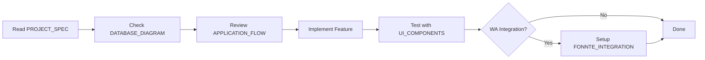

# POS Jamur Cikuda Nusantara - Documentation

Dokumentasi lengkap untuk sistem Point of Sales (POS) Jamur Cikuda Nusantara.

---

## 📚 Daftar Dokumentasi

### 1. [PROJECT_SPEC.md](PROJECT_SPEC.md) - **Master Blueprint**

**📋 Dokumen Utama untuk AI Agent**

Dokumen referensi utama yang harus dibaca AI Agent sebelum coding. Berisi:

- Technology stack lengkap
- Database schema dengan ER diagram
- Migration scripts yang exact
- Eloquent relationships dengan custom foreign keys
- Business rules & logic
- API endpoints
- Development guidelines
- Testing checklist

**Kapan digunakan:**

- Sebelum memulai development
- Saat membuat model, migration, atau controller
- Ketika ada pertanyaan tentang struktur database atau naming convention

---

### 2. [DATABASE_DIAGRAM.md](DATABASE_DIAGRAM.md) - **Database Reference**

**🗄️ Dokumentasi Database Detail**

Penjelasan mendalam tentang struktur database:

- ER Diagram dengan Mermaid
- Detail setiap tabel (kolom, tipe data, constraints)
- Foreign key naming convention (⚠️ PENTING: plural naming!)
- Relationship antar tabel
- Business rules per tabel
- Recommended indexes untuk performance
- Data flow diagram

**Kapan digunakan:**

- Saat membuat atau modifikasi migration
- Debugging query atau relationship issues
- Optimasi database performance
- Memahami data flow

---

### 3. [APPLICATION_FLOW.md](APPLICATION_FLOW.md) - **Process Flows**

**🔄 Alur Proses Aplikasi**

Diagram dan penjelasan alur kerja aplikasi:

#### Owner Dashboard:

- Dashboard overview dengan statistics
- View statistics flow (cards & charts)
- Product management (CRUD)
- Order management (view, filter, update status)
- Categories management
- Resend failed WhatsApp messages

#### POS Dashboard (Cashier):

- Browse products dengan filter
- Add to cart logic
- Cart management (update qty, remove)
- Checkout process detail
- WhatsApp notification via Fonnte

**Kapan digunakan:**

- Memahami user journey
- Implementasi fitur baru
- Testing scenario
- Debugging business logic

---

### 4. [FONNTE_INTEGRATION.md](FONNTE_INTEGRATION.md) - **WhatsApp Gateway**

**📱 Panduan Integrasi Fonnte**

Dokumentasi lengkap untuk WhatsApp Gateway:

- Setup & konfigurasi Fonnte
- Environment variables
- FonnteService implementation
- Order Controller integration
- Message template format
- Error handling & retry mechanism
- API response examples
- Testing guide
- Troubleshooting common issues

**Kapan digunakan:**

- Setup WhatsApp integration
- Debugging WA send issues
- Implementasi retry logic
- Monitoring failed messages

---

### 5. [UI_COMPONENTS.md](UI_COMPONENTS.md) - **UI Design Reference**

**🎨 Komponen & Layout UI**

Visual mockup dan spesifikasi UI lengkap:

#### Owner Dashboard:

- Statistics cards layout
- Product management table & modal
- Order management table & detail
- Categories management
- Chart components

#### POS Dashboard:

- Product grid layout
- Cart sidebar component
- Checkout modal
- Success/error notifications

#### Shared Components:

- Navigation bars
- Toast notifications
- Confirmation dialogs
- Form validations
- Responsive design (mobile/desktop)
- Color scheme & theming

**Kapan digunakan:**

- Implementasi frontend components
- UI/UX development
- Testing UI flow
- Responsive design

---

## 🚀 Quick Start Guide

### Untuk AI Agent / Developer:

1. **Baca Dulu:** [PROJECT_SPEC.md](PROJECT_SPEC.md)
    - Pahami naming convention (plural foreign keys!)
    - Lihat database schema exact
    - Cek business rules

2. **Referensi Database:** [DATABASE_DIAGRAM.md](DATABASE_DIAGRAM.md)
    - Cek structure sebelum buat migration
    - Lihat relationships untuk Eloquent

3. **Implementasi Fitur:** [APPLICATION_FLOW.md](APPLICATION_FLOW.md)
    - Ikuti flow diagram yang sudah ada
    - Pastikan logic sesuai sequence diagram

4. **Setup WhatsApp:** [FONNTE_INTEGRATION.md](FONNTE_INTEGRATION.md)
    - Configure .env
    - Implement FonnteService
    - Test dengan real phone number

5. **Build UI:** [UI_COMPONENTS.md](UI_COMPONENTS.md)
    - Lihat mockup untuk layout
    - Gunakan color scheme yang ditentukan
    - Implement responsive design

---

## ⚠️ Critical Points

### 1. Foreign Key Naming (WAJIB DIIKUTI)

```php
// ❌ SALAH
$table->foreignId('user_id');
public function user() {
    return $this->belongsTo(User::class);
}

// ✅ BENAR
$table->uuid('users_id');
$table->foreign('users_id')->references('id')->on('users');
public function user() {
    return $this->belongsTo(User::class, 'users_id');
}
```

### 2. UUID vs Auto Increment

- **UUID:** users, customers, products, orders, order_items
- **Auto Increment (BIGINT):** categories

### 3. Required Fields in order_items

- `orders_id` (UUID)
- `products_id` (UUID)
- `price_at_purchase` (DECIMAL - price per unit when ordered)
- `subtotal` (DECIMAL - total price for this line item)
- **Note:** Quantity NOT stored in DB, calculated as: `subtotal / price_at_purchase`

### 4. Fonnte Configuration

```env
FONNTE_API_URL=https://api.fonnte.com/send
FONNTE_TOKEN=your_token_here
```

### 5. Cart LocalStorage Structure

```javascript
{
    pos_cart: [
        {
            id: 'uuid',
            name: 'Product Name',
            price: 25000,
            quantity: 2,
            subtotal: 50000,
        },
    ];
}
```

---

## 📊 Database Schema Summary

| Table       | Primary Key | Foreign Keys                  | Purpose            |
| ----------- | ----------- | ----------------------------- | ------------------ |
| users       | UUID        | -                             | Owner & Cashier    |
| customers   | UUID        | -                             | Customer data      |
| categories  | BIGINT (AI) | -                             | Product categories |
| products    | UUID        | categories_id (BIGINT)        | Product catalog    |
| orders      | UUID        | users_id, customers_id (UUID) | Order headers      |
| order_items | UUID        | orders_id, products_id (UUID) | Order line items   |

---

## 🎯 Feature Checklist

### Owner Dashboard

- [x] Statistics cards (sales, orders, pending, WA failed)
- [x] Revenue chart (7 days)
- [x] Product CRUD (with image upload)
- [x] Category CRUD
- [x] Order list with filters
- [x] Order detail view
- [x] Update payment status
- [x] Resend WhatsApp

### POS Dashboard

- [x] Product grid with search & filter
- [x] Shopping cart with localStorage
- [x] Quantity controls (+/-)
- [x] Checkout modal with customer form
- [x] Auto WhatsApp via Fonnte
- [x] Success/error notifications

### WhatsApp Integration

- [x] Fonnte service setup
- [x] Auto send on order created
- [x] Message template (order details)
- [x] Phone number formatting (+62)
- [x] Status tracking (PENDING/SENT/FAILED)
- [x] Manual retry for failed sends

---

## 🔧 Development Workflow



---

## 📞 Support & Resources

- **Fonnte Dashboard:** https://app.fonnte.com
- **Fonnte Docs:** https://docs.fonnte.com
- **Laravel 12 Docs:** https://laravel.com/docs/12.x
- **Inertia.js Docs:** https://inertiajs.com
- **React 19 Docs:** https://react.dev
- **Tailwind CSS 4.0:** https://tailwindcss.com
- **TypeScript Docs:** https://www.typescriptlang.org/docs

---

## 📝 Version History

| Version | Date       | Changes                                    |
| ------- | ---------- | ------------------------------------------ |
| 1.1     | 2026-01-23 | **Updated to match actual implementation** |
|         |            | - Laravel 12 + PHP 8.2+ (not Laravel 11)   |
|         |            | - React 19 + TypeScript 5.7                |
|         |            | - Tailwind CSS 4.0, Vite 7.0               |
|         |            | - Fixed: categories has NO timestamps      |
|         |            | - Fixed: order_items has NO quantity field |
|         |            | - Quantity calculated: subtotal/price      |
| 1.0     | 2026-01-23 | Initial documentation complete             |
|         |            | - PROJECT_SPEC.md                          |
|         |            | - DATABASE_DIAGRAM.md                      |
|         |            | - APPLICATION_FLOW.md                      |
|         |            | - FONNTE_INTEGRATION.md                    |
|         |            | - UI_COMPONENTS.md                         |
|         |            | - Added quantity field to order_items      |
|         |            | - Added timestamps to categories           |
|         |            | - Synchronized all references              |

---

**Last Updated:** January 23, 2026  
**Maintained By:** Development Team  
**Project:** POS Jamur Cikuda Nusantara
